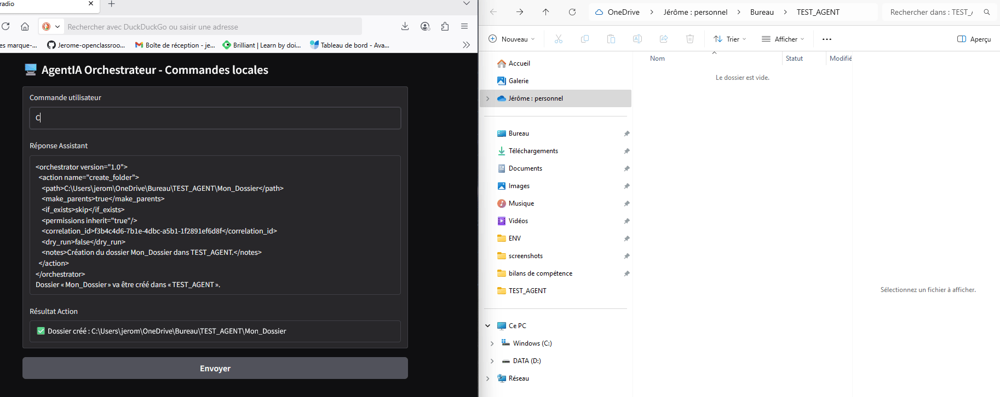

# 🖥️ Agent Orchestrateur IA — Proof of Concept

Ce projet démontre un **agent IA local** capable d'interpréter des commandes en langage naturel, de générer des **instructions XML structurées**, et d'exécuter des **actions réelles sur l'OS** comme créer des dossiers ou des fichiers et y écrire du contenu.

L'objectif est d'illustrer comment, à terme, les **systèmes d'exploitation du futur** pourraient être pilotés uniquement par des prompts en langage naturel, où l'utilisateur exprime une intention et l'IA orchestre les actions nécessaires en toute sécurité — sans navigation manuelle ni boîtes de dialogue, juste de l'automatisation intelligente.

---

## 📂 Structure du projet

```
.
├── README.md            ← README en anglais
├── README_Fr.md         ← Ce fichier (français)
├── code/
│   ├── HelloWorld_AI_Agent.ipynb    ← Première version (Python pur + API OpenAI)
│   └── AI_Agent_Langchain.ipynb     ← Version modulaire avec LangChain
└── screenshot/
    └── demo.gif          ← Démo animée : création de dossier + création de fichier via prompt
```

---

## 🚀 Fonctionnalités

- **Interface en langage naturel** — Demandez à l’agent de créer des dossiers ou des fichiers, il génère les instructions XML correspondantes.
- **Format strict** — Le bloc XML `<orchestrator>` est interprétable par une machine et sécurisé.
- **Exécution locale** — Le code Python analyse le XML et exécute l’action sur votre machine.
- **Deux implémentations** :
  - *HelloWorld_AI_Agent.ipynb* : version minimale avec API OpenAI directe.
  - *AI_Agent_Langchain.ipynb* : version modulaire LangChain avec séparation claire des composants.
- **UI Gradio** — Exécutable en local ou partageable via un lien public (`share=True`) pour démo.

---

## 🧠 Fonctionnement

1. **Saisie de la commande**  
   Par exemple :
   ```
   Crée un dossier Test sur le Bureau.
   ```
2. **Interprétation par le LLM**  
   L’assistant transforme la demande en instruction XML :
   ```xml
   <orchestrator version="1.0">
     <action name="create_folder">
       <path>C:\Users\jerom\OneDrive\Bureau\Test</path>
       <make_parents>true</make_parents>
       <if_exists>skip</if_exists>
       <encoding>utf-8</encoding>
       <correlation_id>...</correlation_id>
       <notes>Création idempotente du dossier.</notes>
     </action>
   </orchestrator>
   ```
3. **Exécution**  
   Le code Python analyse le XML, applique les règles de sécurité et exécute l’action localement.

---

## 🎥 Démo

  
*L’agent crée un dossier à partir d’un prompt, puis crée un fichier texte à l’intérieur avec un message personnalisé.*

---

## 💡 Pourquoi c’est important

Ce projet est une **preuve de concept** d’**OS piloté par prompt** :  
- Dans le futur, le **contrôle du système** pourra être conversationnel — de la gestion de fichiers à la configuration système, entièrement via langage naturel.
- Les agents IA pourront agir comme interprètes sécurisés entre l’intention humaine et les commandes système.
- Cette approche réduit la navigation répétitive et rend les flux de travail plus rapides et intuitifs.

---

## 🛠️ Prérequis

- Python 3.9+
- Packages :  
  ```bash
  pip install openai langchain-openai gradio python-dotenv
  ```
- Clé API OpenAI stockée dans `ENV/env.txt` :
  ```
  OPENAI_API_KEY=sk-...
  ```

---

## ▶️ Lancer le projet

1. Cloner le dépôt.
2. Placer la clé API dans `ENV/env.txt`.
3. Ouvrir l’un des notebooks :
   - `code/HelloWorld_AI_Agent.ipynb` pour la version Python de base.
   - `code/AI_Agent_Langchain.ipynb` pour la version modulaire LangChain.
4. Exécuter toutes les cellules et lancer l’UI Gradio.
5. Commencer à envoyer des prompts à l’agent !

---

## 📜 Licence

Licence MIT — libre d’utilisation et de modification.
